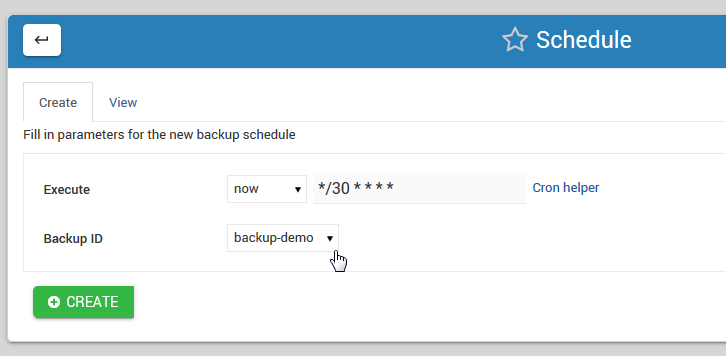

.. This is a comment. Note how any initial comments are moved by
   transforms to after the document title, subtitle, and docinfo.

.. demo.rst from: http://docutils.sourceforge.net/docs/user/rst/demo.txt

.. |EXAMPLE| image:: static/yi_jing_01_chien.jpg
   :width: 1em

**********************
Schema Backups
**********************

.. contents:: Table of Contents

Backup Manager
==============

To access the Schema Backups Manager, click the Backups icon as show below.

      .. image:: _static/backups-tab.png
      
Layout
==============

The Backup Manager tab allows you to create, edit, and delete scheduled schema backups.
   
      .. image:: _static/backups.png

   
Create Backup
=============

To create a new schema backup, enter the backup name and click create.

A template will be created and you just need to simply fill in the schema/password and FTP or offsite information.

Edit Backup
===========

To edit a backup, select the script from the drop down.

Make the required edits and click Save.

Backup Location
===============

By default, backups are saved to /opt/oracle/admin/XE/dpdump unless otherwise specified.

Scheduling Backups
==================

Backups can be scheduled with a variety of options via the Schedule tab as shown below:

.. image:: _static/schedule-tab.png

On the main Schedule page, click the Add tab to open the Create Schedule page as shown below.  

Scheduling Options
==================

The Schedule module offers the following options.

**Execute**::

   Options:
      now
      custom
      hourly
      weekly
      monthly
      
now:  This will run the Backup immediately, with no subsequent runs.

custom: This option allows you to enter a custom cron for running the Backups
 
hourly, weekly, and monthly are as stated.
 
**Name**::

   Options:
      Drop-down list of all available Backups

The Name field will display a list of all available Backup scripts.  

Above, we have select the DemoScript.sh we created earlier.

**File Name**::

   Options:
      Set in backup.sh file

Enter the desired Data Source for the report.

**Email**::

   Options:
      Set in backup.sh file

.. note::
    All options are set within your backup.sh file

   

