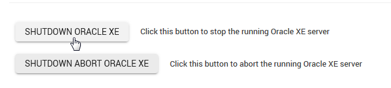

.. This is a comment. Note how any initial comments are moved by
   transforms to after the document title, subtitle, and docinfo.

.. demo.rst from: http://docutils.sourceforge.net/docs/user/rst/demo.txt

.. |EXAMPLE| image:: static/yi_jing_01_chien.jpg
   :width: 1em

**********************
Oracle XE
**********************

.. contents:: Table of Contents

Controls
========

Oracle XE can be started and stopped via Servers > Tomcat XE

Command Line
============

To start/stop/restart Oracle XE via command line.

1.  Connect to SQLPlus::

.. code-block:: console
   :linenos:
    sqlplus /nolog
    connect sys/PASSWORD as sysdba

2.  Issue the start/stop commands

.. code-block:: console
   :linenos:

    startup | shutdown | shutdown abort | startup nomount | startup mount

Init Script
===========

The XE init script is located in /etc/init.d/oracle-xe-18c

Version
=======

XE Version is 18c

