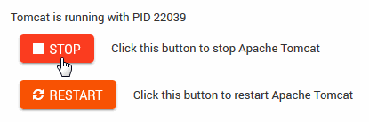

.. This is a comment. Note how any initial comments are moved by
   transforms to after the document title, subtitle, and docinfo.

.. demo.rst from: http://docutils.sourceforge.net/docs/user/rst/demo.txt

.. |EXAMPLE| image:: static/yi_jing_01_chien.jpg
   :width: 1em

**********************
Oracle XE
**********************

.. contents:: Table of Contents

Controls
========

Oracle XE can be started and stopped via Servers > Tomcat XE

Command Line
=============

To start/stop/restart Oracle XE via command line.

1.  Connect to SQLPlus::

   .. code-block:: console
   :linenos:

    sqlplus /nolog
    connect sys/PASSWORD as sysdba

2.  Issue the start/stop commands

.. code-block:: console
   :linenos:

    startup | shutdown | shutdown abort | startup nomount | startup mount

Init Script
===========

The XE init script is located in /etc/init.d and has the following content.

.. code-block:: bash
   :linenos:

	#!/bin/bash
	### BEGIN INIT INFO
	# Provides:        tomcat
	# Required-Start:  $network
	# Required-Stop:   $network
	# Default-Start:   2 3 4 5
	# Default-Stop:    0 1 6
	# Short-Description: Start/Stop Tomcat server
	### END INIT INFO

	# Source function library.
	. /etc/environment;	#Catalina variables
	. $CATALINA_HOME/bin/setenv.sh

	RETVAL=$?

	function start(){
	echo "Starting Tomcat"
	/bin/su - tomcat $CATALINA_HOME/bin/startup.sh
	RETVAL=$?
	}

	function stop(){
	echo "Stopping Tomcat"
	/bin/su - tomcat -c "$CATALINA_HOME/bin/shutdown.sh 60 -force"
	RETVAL=$?
	}

	case "$1" in
 	start)
		start;
        ;;
 	stop)
		stop;
        ;;
 	restart)
		echo "Restarting Tomcat"
    	stop;
		start;
        ;;
 	status)

		if [ -f "${CATALINA_PID}" ]; then
			TOMCAT_PID=$(cat "${CATALINA_PID}")
			echo "Tomcat is running with PID ${TOMCAT_PID}";
			RETVAL=1
		else
			echo "Tomcat is not running";
			RETVAL=0
		fi
		;;
 	*)
        echo $"Usage: $0 {start|stop|restart|status}"
        exit 1
        ;;
	esac
	exit $RETVAL

Version
=======

XE Version is 18c

