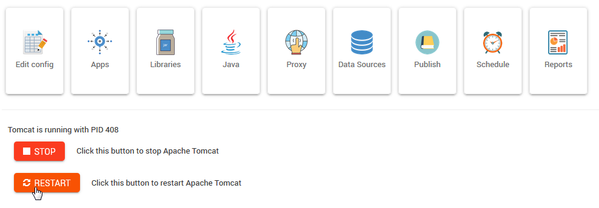

Intro
===========================

Overview
------------

Enciva XE is a Webmin module that manages Oracle XE, Apex, Tomcat, Java, and `JasperReportsIntegration`_

.. _`JasperReportsIntegration`: https://www.opal-consulting.de/downloads/free_tools/JasperReportsIntegration/ 

It also provides Backups, Report Publishing, Report Scheduling, and Report Management.

Operating Systems
-----------------
* CentOS 7
* OEL 7

Authors
-------
* `David Ghedini`_

.. _`David Ghedini`: https://github.com/DavidGhedini

Components
----------

`Oracle XE`_

.. _`Oracle XE`: https://www.oracle.com/database/technologies/appdev/xe.html

`Oracle APEX`_

.. _`Oracle APEX`: https://apex.oracle.com/en/ 

`Oracle ORDS`_

.. _`Oracle ORDS`: https://www.oracle.com/database/technologies/appdev/rest.html 

`JasperReportsIntegration`_

.. _`JasperReportsIntegration`: https://www.opal-consulting.de/downloads/free_tools/JasperReportsIntegration/ 

`Jasper Reports Library`_

.. _`Jasper Reports Library`: https://community.jaspersoft.com/project/jasperreports-library 

`Apache Tomcat`_

.. _`Apache Tomcat`: http://tomcat.apache.org/ 

`OpenJDK`_

.. _`OpenJDK`: https://openjdk.java.net/
 

   

